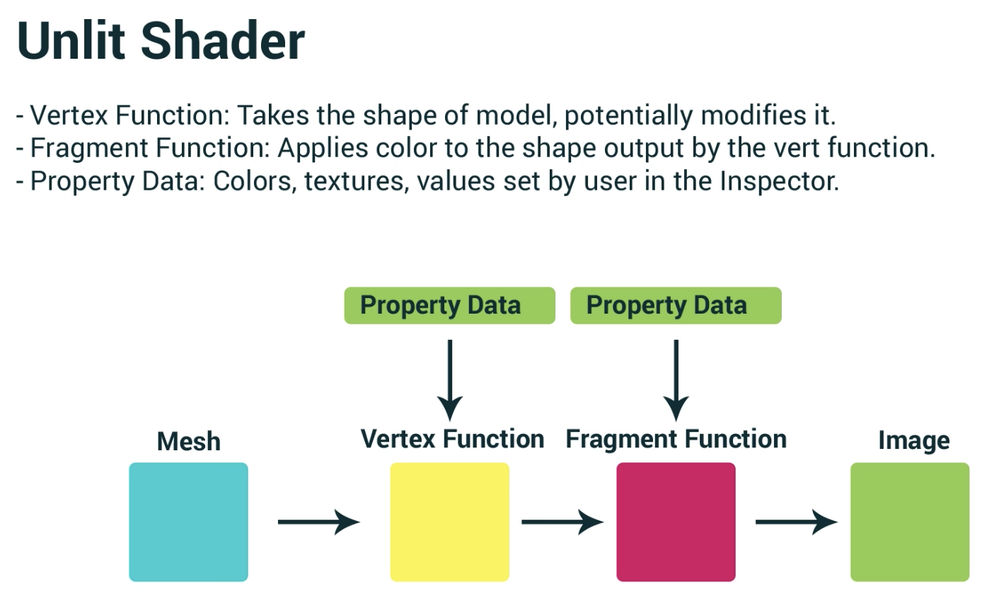

# Hologram Shader
This project runs over the fundamentals of Unity shaders buy putting together an unlit shader which could be used for a hologram with a glitching effect.

[Unity Tutorial](https://learn.unity.com/tutorial/writing-your-first-shader-in-unity#5c7f8528edbc2a002053b577)

 

## How it fits together:
>### **3D model**
>- Vertex positions (model points)
>- Vectex colours
>- Nromals (vertex directions)
>- UV data (texture mapping)

has a

>### **Material**
>- Textures
>- Shader property values

uses a

>### **Shader**
> A program made to run on a GPU. It ultimately draws the triangles of your 3D models.
>- CG / HLSL code

---
 

## Shader Types:
- Surface Shaders - interacts with lights
- **Unlit Shaders** - has no interaction with unity's lights
- Image Effect Shaders
- Compute shaders

 

## ShaderLab
- Mix of 2 languages
- Tells Unity how to render things
- CG Program and CG block for Graphics code to run on GPI
- Properties define shader variables

 
Shaders do not use inheritance

---
 

 

